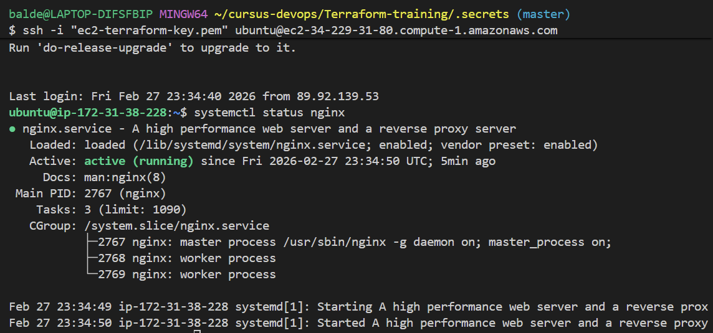
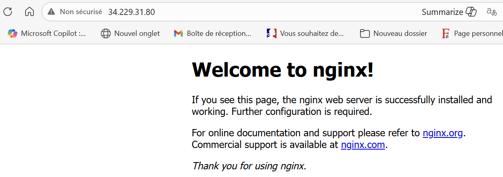
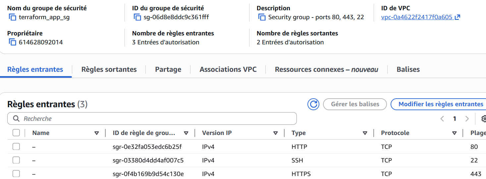
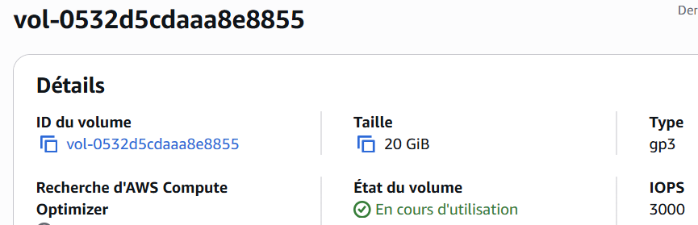

# Projet Terraform - Déploiement EC2 sur AWS

## Illustrations :
<p align="center">
  
</p>

<p align="center">
  
</p>

<p align="center">
  
</p>

<p align="center">
  
</p>
## Description

Ce projet Terraform déploie une infrastructure complète sur AWS composée de 4 modules indépendants et réutilisables :
- Une instance EC2 avec la derniere version de Ubuntu Bionic avec Nginx installé
- Un volume EBS attaché à l'instance
- Une Elastic IP (IP publique) associée à l'instance
- Un Security Group ouvrant les ports 80, 443 et le port 22 permettant les connexions ssh.

---

## Architecture

```
projet-terraform/
├── modules/
│   ├── ec2/                  # Module instance EC2
│   │   ├── main.tf
│   │   ├── variables.tf
│   │   └── outputs.tf
│   ├── ebs/                  # Module volume EBS
│   │   ├── main.tf
│   │   ├── variables.tf
│   │   └── outputs.tf
│   ├── eip/                  # Module Elastic IP
│   │   ├── main.tf
│   │   ├── variables.tf
│   │   └── outputs.tf
│   └── security_group/       # Module Security Group
│       ├── main.tf
│       ├── variables.tf
│       └── outputs.tf
└── app/                      # Dossier d'utilisation des modules
    ├── main.tf
    ├── variables.tf
    ├── outputs.tf
    └── terraform.tfvars
```

---

## Prérequis

- [Terraform](https://developer.hashicorp.com/terraform/downloads) >= 1.0
- [AWS CLI](https://aws.amazon.com/cli/) configuré avec vos credentials
- Une clé SSH créée dans AWS EC2 (ex: `ec2-terraform-key`)
- Le fichier `.pem` de la clé SSH placé dans `.secrets/` (./../../.secrets/${var.key_name}.pem)

---

## Modules

### Module `security_group`
Crée un Security Group AWS ouvrant les ports suivants :
- **80** (HTTP)
- **443** (HTTPS)
- **22** (SSH - nécessaire pour le provisioner remote-exec)

| Variable | Description | Défaut |
|----------|-------------|--------|
| `sg_name` | Nom du security group | - |
| `sg_description` | Description | `Security group managed by Terraform` |
| `vpc_id` | ID du VPC | - |

---

### Module `ebs`
Crée un volume EBS avec une taille variabilisée.

| Variable | Description | Défaut |
|----------|-------------|--------|
| `ebs_size` | Taille en GB | `10` |
| `availability_zone` | Zone de disponibilité | - |
| `ebs_name` | Tag Name | `ebs-terraform` |

L'AZ du volume EBS doit être identique à celle de l'instance EC2.

---

### Module `eip`
Crée une Elastic IP (IP publique) dans le scope VPC.

| Variable | Description | Défaut |
|----------|-------------|--------|
| `sg_id` | ID du security group | - |
| `eip_name` | Tag Name | `eip-terraform` |

---

### Module `ec2`
Crée une instance EC2 avec la deniere version de Ubuntu Bionic avec :
- Installation automatique de Nginx via `remote-exec`
- Attachement du volume EBS
- Association de l'Elastic IP
- Sauvegarde de l'IP publique dans `ip_ec2.txt`

| Variable | Description | Défaut |
|----------|-------------|--------|
| `instance_type` | Type d'instance | `t2.micro` |
| `aws_common_tag` | Tags (map) | `{Name = "ec2-terraform"}` |
| `ami_id` | AMI Ubuntu Bionic 18.04 | `ami-0e761650b658ef0a2` |
| `sg_id` | ID du security group | - |
| `eip_id` | ID de l'Elastic IP | - |
| `public_eip` | Adresse IP publique | - |
| `ebs_id` | ID du volume EBS | - |
| `availability_zone` | Zone de disponibilité | `eu-west-3a` |
| `subnet_id` | ID du subnet | - |
| `key_name` | Nom de la clé SSH | `ec2-terraform-key` |

---

## Déploiement

### 1. Configurer les variables

Editez le fichier `app/terraform.tfvars` avec vos valeurs :

```hcl
aws_region        = "us-east-1"
availability_zone = "us-east-1d"
vpc_id            = "vpc-xxxxxxxxx"
subnet_id         = "subnet-xxxxxxxxx"
instance_type     = "t3.micro"
ebs_size          = 10
sg_name           = "terraform-sg-app"
key_name          = "ec2-terraform-key"

aws_common_tag = {
  Name        = "ec2-terraform-app"
  Environment = "dev"
  Project     = "terraform-commun"
}
```

### 2. Initialiser Terraform

```bash
cd app
terraform init
```

### 3. Vérifier le plan

```bash
terraform plan
```

### 4. Déployer l'infrastructure

```bash
terraform apply
```

### 5. Vérifier le déploiement

Après le déploiement :
- Nginx est accessible via `http://<ip_publique>`
- L'IP publique est sauvegardée dans `app/ip_ec2.txt`

---

## Destruction de l'infrastructure

```bash
cd app
terraform destroy
```

Le volume root est configuré avec `delete_on_termination = true`, il sera automatiquement supprimé avec l'instance.

---

## Outputs

| Output | Description |
|--------|-------------|
| `public_ip` | IP publique de l'instance EC2 |
| `instance_id` | ID de l'instance EC2 |
| `ebs_id` | ID du volume EBS |
| `sg_id` | ID du Security Group |

---

## .gitignore

Les fichiers suivants sont exclus du repo pour des raisons de sécurité :

```
**/.terraform/
*.tfstate
*.tfstate.backup
.secrets/
*.pem
ip_ec2.txt
```
---

## Auteur
Projet réalisé dans le cadre de la formation **EazyTraining**.
